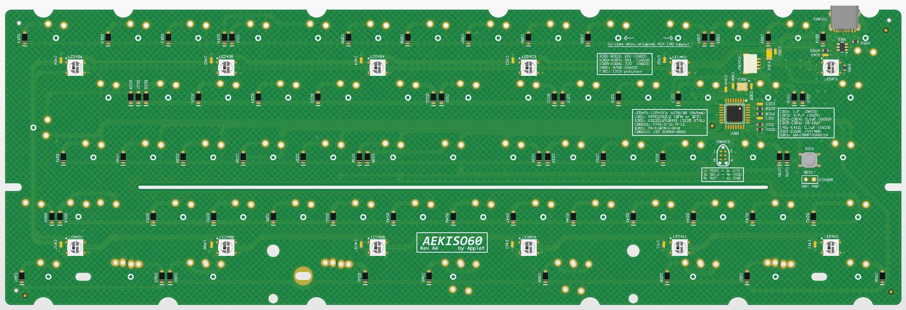
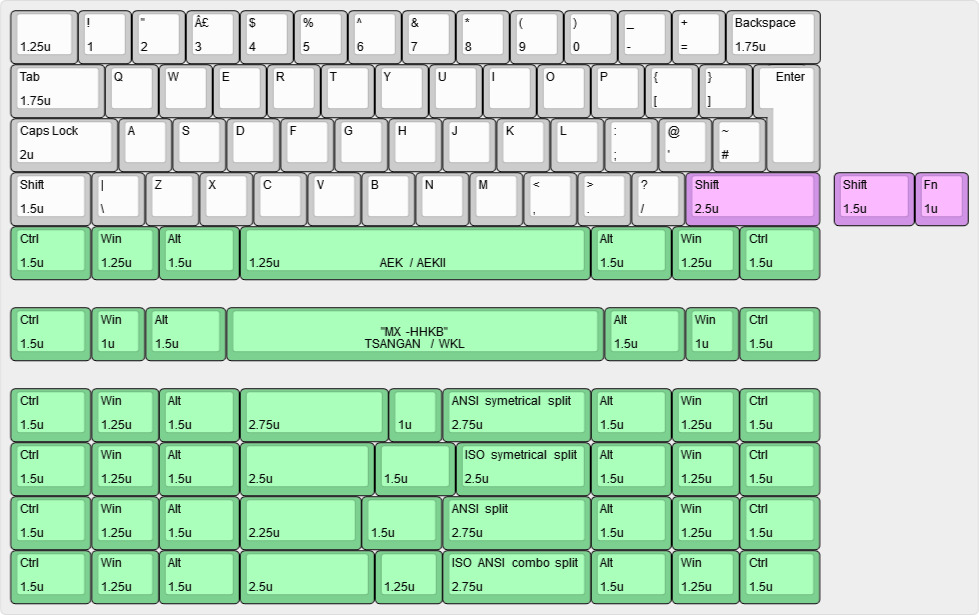

# AEKISO60

AEKISO60 is a PCB for use of AEK ISO keycaps in 60% builds, there is some compatibility issues with tray-mount cases due to the AEK ISO layout: Only the mounting hole under space and the ones at the sides can be used. See Altium view of PCB.

## Some features:
- QMK
- USB C
- RGB underglow
- USB horizontal placement is classic GH60, same as GH60, plain60, voyager60 etc.
- ISO AEK Layout support with extensive bottom row support

## Availability:
As an option to DIY, I'll try and keep these available for purchase here: https://4pplet.com/ For DIY, the production files are avaliable in releases.

## Altium view of PCB

## Layout support: 

## Plate-instruction:
The capslock stabilizer is rotated to give space for the tray-mount screw opening in the plate. Here is a video and picture demonstrating how the stabilizer should be mounted: https://imgur.com/a/tCZg3jl Credits to huygn for making it.

## Revisions:
- Rev A1: Initial prototype
- Rev A2: Improved routing, alligned PCB outline and port position with the other projects. Changed ESD-protection, diodes and XTAL for better compatibility with JLC SMD library.
- Rev A3: Moved daughter board connector to allign with my other 60% projects (same position as cyber60, steezy60 and waffling60-solder)
- Rev A4: Moved daughter board connector for better fitment in bakeneko. Added cutout for bakeneko V3 (untested). Minor siklscreen tweaks.

<a href='https://ko-fi.com/4pplet' target='_blank'>
