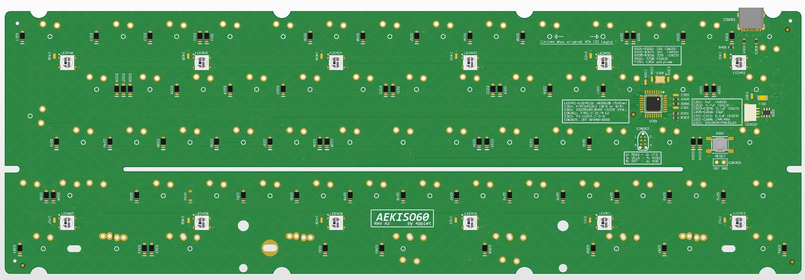

# AEKISO60

AEKISO60 is a PCB for use of AEK ISO keycaps in 60% builds, there is some compatibility issues with tray-mount cases due to the different layout.

## Some features:
- QMK
- USB C
- RGB underglow
- ISO AEK Layout support with extensive bottom row support

## Altium view of PCB

## Layout support: 

## Revisions:
- Rev A1: Initial prototype
